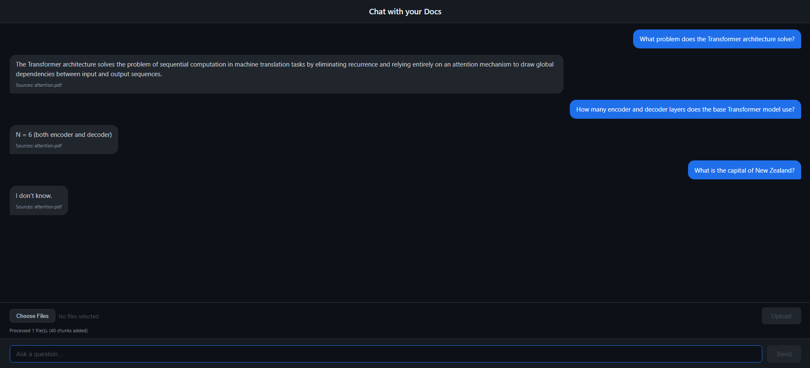

# 📄 Chat With Your Documents

A full-stack RAG (Retrieval-Augmented Generation) app that lets you upload your own documents and ask natural language questions about them. Answers are grounded in your document content with source citations — the model won't guess if the answer isn't there.

Built with Python, SentenceTransformers, ChromaDB, Ollama, FastAPI, and Vue.js. Runs fully locally — no OpenAI API key, no cloud costs. One-command setup with Docker.



---

## 💡 How It Works

RAG = **Retrieval-Augmented Generation**. Instead of asking an LLM a question blind, the app first retrieves the most relevant passages from your uploaded documents, then feeds those passages to the LLM as context. The model answers from *your data* — and says "I don't know" if the answer isn't there.

The pipeline runs in six stages:

```
1. LOAD      → parse uploaded PDF / TXT / MD / DOCX files from memory
2. CHUNK     → split documents into overlapping passages
3. EMBED     → convert each chunk into a vector (SentenceTransformers)
4. STORE     → persist vectors in a local vector database (ChromaDB)
5. RETRIEVE  → embed the user's question, find the top-k nearest chunks
6. GENERATE  → pass those chunks to an LLM (Ollama) and return answer + sources
```

Every time the backend starts, the vector store is cleared — only files you upload through the UI are ever indexed.

---

## 🛠️ Tech Stack

| Layer              | Tool                                        |
|--------------------|---------------------------------------------|
| LLM                | [Ollama](https://ollama.com) + Llama 3.1 8B |
| Embeddings         | SentenceTransformers (`all-MiniLM-L6-v2`)   |
| Vector DB          | ChromaDB (local, persistent)                |
| PDF + DOCX Parsing | pypdf + python-docx                         |
| Backend API        | FastAPI + Uvicorn                           |
| Frontend           | Vue 3 + Vite (Composition API)              |
| Containerisation   | Docker + Docker Compose                     |
| Language           | Python 3.12                                 |

---

## ✅ Prerequisites

**To run with Docker (recommended):**
- [Docker Desktop](https://www.docker.com/products/docker-desktop)
- NVIDIA GPU with drivers 526+ — optional, for GPU acceleration (Windows/Linux only)

**To run locally without Docker:**
- Python 3.10+
- Node.js 22+
- Git
- [Ollama](https://ollama.com)

---

## 🐳 Quick Start with Docker (Recommended)

### 🪟 Windows / Linux (with NVIDIA GPU support)

**1. Clone the repository**

```bash
git clone https://github.com/soorajjsbabu/chat-with-docs.git
cd chat-with-docs
```

**2. Start all services**

```bash
docker compose up --build
```

**3. Pull the LLM model**

In a new terminal while docker compose is running:

```bash
docker exec -it chat-with-docs-ollama-1 ollama pull llama3.1:8b
```

**4. Open the app**

Go to **http://localhost:5173** in your browser.

> **GPU Note:** If you have an NVIDIA GPU (driver 526+), Ollama automatically uses it inside Docker for much faster responses. No extra configuration needed.

---

### 🍎 Apple Silicon (Mac M1 / M2 / M3 / M4)

Docker on Mac doesn't support NVIDIA GPU passthrough, so a separate compose file is provided that removes the GPU config. Ollama still uses the Apple Neural Engine (Metal) automatically for fast inference.

**1. Clone the repository**

```bash
git clone https://github.com/soorajjsbabu/chat-with-docs.git
cd chat-with-docs
```

**2. Start all services using the Mac compose file**

```bash
docker compose -f docker-compose.mac.yml up --build
```

**3. Pull the LLM model**

In a new terminal while docker compose is running:

```bash
docker exec -it chat-with-docs-ollama-1 ollama pull llama3.1:8b
```

**4. Open the app**

Go to **http://localhost:5173** in your browser.

> **Note:** On Apple Silicon, Ollama uses Metal GPU acceleration automatically — no additional setup needed.

---

### Updating to the latest version

If you already cloned the repo and want the latest changes:

```bash
git pull
docker compose down
docker compose up --build   # Windows/Linux
# or
docker compose -f docker-compose.mac.yml down
docker compose -f docker-compose.mac.yml up --build   # Mac
```

The Ollama model is stored in a Docker volume and does not need to be re-downloaded after updates.

---

## 🚀 Running Without Docker

If you prefer to run without Docker, you need three terminals running simultaneously.

### Setup

```bash
# 1. Create and activate virtual environment

# Windows
python -m venv .venv
.venv\Scripts\activate

# macOS/Linux
python3 -m venv .venv
source .venv/bin/activate

# 2. Install Python dependencies
pip install -r requirements.txt

# 3. Pull the Ollama model (~5 GB)
ollama pull llama3.1:8b

# 4. Install frontend dependencies
cd frontend && npm install && cd ..
```

### Run

**Terminal 1 — Ollama:**
```bash
ollama serve
```

**Terminal 2 — FastAPI backend:**
```bash
uvicorn api.main:app --reload
```

**Terminal 3 — Vue frontend:**
```bash
cd frontend
npm run dev
```

Open **http://localhost:5173**

---

## 📖 How to Use

1. Open **http://localhost:5173**
2. Click the **paperclip icon** next to the input bar to open the upload modal
3. Drag and drop files onto the zone or click **Choose Files**
4. Supports PDF, TXT, MD and DOCX — up to 5 files at a time
5. Click **Upload** and wait for the confirmation (e.g. *"Processed 2 file(s). 84 chunks added"*)
6. The modal closes automatically after a successful upload
7. Type a question about your documents and press **Enter** or click **Send**
8. The assistant streams the answer token by token with source citations below

> **Note:** The vector store clears on every backend restart. Re-upload your files after restarting the server.

---

## 📁 Project Structure

```
chat-with-docs/
├── src/
│   ├── config.py         # All settings — models, chunk size, top-k, temperature
│   ├── loader.py         # Stage 1: parse PDF, TXT, MD, DOCX files from memory
│   ├── chunker.py        # Stage 2: split text into overlapping chunks
│   ├── embedder.py       # Stage 3: convert chunks to vectors
│   ├── vectorstore.py    # Stage 4: store and query vectors (ChromaDB)
│   ├── ingest.py         # Orchestrates stages 1–4 for local ingestion
│   └── rag.py            # Stages 5–6: retrieve chunks + generate/stream answer
├── api/
│   └── main.py           # FastAPI — /api/query, /api/query/stream, /api/upload
├── frontend/
│   ├── src/
│   │   ├── App.vue       # Chat UI — welcome screen, modal upload, streaming
│   │   └── style.css     # Global styles and dark gradient theme
│   ├── Dockerfile        # Frontend container (Node 22 + Nginx)
│   └── package.json
├── tests/
│   └── eval.py           # RAG evaluation — retrieval, faithfulness, abstention
├── screenshots/
│   └── UI.png
├── docs/                 # Local documents for CLI ingestion (gitignored)
├── Dockerfile            # Backend container (Python 3.12)
├── docker-compose.yml    # Windows/Linux — includes NVIDIA GPU passthrough
├── docker-compose.mac.yml # macOS Apple Silicon — no GPU config
├── .dockerignore
├── .gitignore
├── requirements.txt
└── README.md
```

---

## 🔌 API Endpoints

| Method | Endpoint            | Description                                        |
|--------|---------------------|----------------------------------------------------|
| POST   | `/api/query`        | Ask a question — `{"question": "string"}`          |
| POST   | `/api/query/stream` | Stream answer token-by-token (`text/event-stream`) |
| POST   | `/api/upload`       | Upload files (`multipart/form-data`)               |
| GET    | `/api/health`       | Health check — `{"status": "ok"}`                  |

Interactive API docs: **http://localhost:8000/docs**

---

## ⚙️ Configuration

All settings are in `src/config.py`:

```python
EMBED_MODEL   = "all-MiniLM-L6-v2"                          # SentenceTransformers model
LLM_MODEL     = "llama3.1:8b"                               # Ollama model name
CHUNK_SIZE    = 1200                                        # Characters per chunk
CHUNK_OVERLAP = 200                                         # Overlap between chunks
TOP_K         = 8                                           # Chunks retrieved per question
TEMPERATURE   = 0.1                                         # Low = precise, High = creative
OLLAMA_URL    = os.getenv("OLLAMA_URL", "http://localhost:11434")
```

Swap `LLM_MODEL` to any model supported by Ollama (e.g. `mistral:7b`, `llama3.2:3b`).

---

## 🗺️ Roadmap

- [x] Project setup and environment configuration
- [x] Document loader — PDF, TXT, MD, DOCX support
- [x] Text chunker with configurable overlap
- [x] SentenceTransformers embedder with GPU support
- [x] ChromaDB vector store with persistence
- [x] RAG query engine with source citations
- [x] "I don't know" guardrail — model abstains when answer isn't in context
- [x] FastAPI backend with query, stream and upload endpoints
- [x] Vue 3 frontend with dark gradient theme
- [x] Live file upload — documents indexed at runtime
- [x] Multi-file upload — up to 5 files simultaneously
- [x] File upload modal with drag and drop
- [x] SVG paperclip attach button in input bar
- [x] Uploaded files panel showing indexed documents
- [x] Welcome screen with animated header transition
- [x] Token-by-token streaming responses
- [x] Docker + Docker Compose — one-command setup
- [x] NVIDIA GPU passthrough for Ollama in Docker (Windows/Linux)
- [x] Apple Silicon support via docker-compose.mac.yml
- [x] Answer faithfulness evaluation — 89% overall score across 3 documents
- [x] Low temperature (0.1) for reduced hallucination

---

## 🧠 What I Learned

- How RAG works end-to-end — from chunking strategy to prompt design
- Why embedding normalisation matters for cosine similarity search
- How vector databases differ from traditional databases
- Designing a responsible AI guardrail that prevents hallucination
- Why low temperature improves factual accuracy in RAG systems
- Connecting a FastAPI backend to a Vue 3 frontend with CORS
- Handling multipart file uploads in FastAPI with `python-multipart`
- Multi-container Docker setup with service networking and named volumes
- NVIDIA GPU passthrough to Docker containers on Windows
- Apple Silicon Metal GPU acceleration with Ollama on Mac
- Building a RAG evaluation framework measuring retrieval accuracy, answer faithfulness and abstention rate across multiple documents
- Implementing token-by-token streaming with server-sent events connecting FastAPI StreamingResponse to Vue's ReadableStream API

---

## 📝 Known Limitations

- Vector store clears on server restart — re-upload files after restarting
- Large PDFs with complex layouts (columns, tables) may have lower retrieval accuracy due to pypdf text extraction order
- No authentication — intended for local use only
- Docker GPU passthrough not supported on Apple Silicon (Metal acceleration used instead)

---

## 👤 Author

**Sooraj Srinivasa Babu**
[LinkedIn](https://linkedin.com/in/soorajsrinivasababu) · [GitHub](https://github.com/soorajjsbabu)
